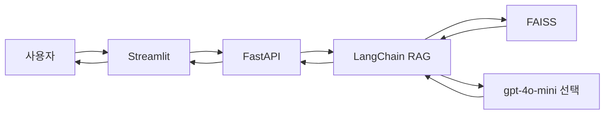

# 부산 여행 코스 추천

부산을 방문하는 관광객이 **날짜, 동행, 목적, 숙소, 활동 반경, 활동 강도**를 넣으면  
TourAPI 장소 데이터를 RAG로 검색해 **숙소 좌표 반경 안의 일차별 코스**를 만듭니다.

`.env`에 `OPENAI_API_KEY`가 있으면 `gpt-4o-mini`가 일정 문장을 쓰고,  
없으면 FAISS 검색 초안만 반환합니다.

---

## 주요 기능

- 여행 시작일/종료일(최대 7일), 동행자, 목적에 따른 맞춤 검색
- TourAPI 숙박 목록에서 숙소를 고르고, 그 좌표를 **하루의 시작점**으로 사용
- 활동 반경(약 3~25km)과 활동 강도(카페 위주 ~ 산·숲)로 후보 필터
- 한국어 임베딩 + FAISS 유사도 검색, LangChain RAG로 코스 생성
- Streamlit 입력 → FastAPI `POST /api/recommend`

---

## 기술 스택

| 구분 | 기술 |
|------|------|
| Frontend | Streamlit |
| Backend | FastAPI |
| ML / AI | LangChain, sentence-transformers, FAISS, RAG |
| 데이터 | 한국관광공사 TourAPI 4.0 (`KorService2`) |
| Language | Python |

---

## 시스템 아키텍처



추천 시 한 번에 부산 전체를 검색하지 않습니다.  
**일차마다 숙소 위경도 + 반경(km)** 안에서만 후보를 고른 뒤 LLM(또는 초안)에 넘깁니다.

---

## 사용자 입력

| 필드 | 설명 |
|------|------|
| `start_date`, `end_date` | 여행 기간. 포함 일수 1~7일 |
| `companion` | 혼자 / 커플 / 친구 / 가족 / 기타 |
| `purpose` | 힐링 / 맛집 / 문화관광 / 쇼핑 / 자연/액티비티 / 종합 |
| `lodging_ids` | TourAPI 숙박 `id`. 1개면 전 기간 동일, 아니면 일차 수만큼 |
| `radius` | 1~5 → 약 3 / 6 / 10 / 15 / 25 km |
| `intensity` | 1~5. 하루 장소 수와 산·숲 허용 여부 |

관련 API:

- `GET /api/lodgings?q=` — 숙박 검색 (이름·구·주소)
- `POST /api/recommend` — 코스 생성

---

## 프로젝트 구조

```
.
├── README.md
├── requirements.txt
├── .env
├── frontend/app.py
├── backend/
│   ├── main.py
│   ├── routers/recommend.py
│   ├── schemas/request.py
│   └── services/recommend_service.py
├── ml/
│   ├── rag/                 # chain, retriever, prompt, preferences
│   ├── embeddings/
│   └── vectorstore/
├── docs/PROJECT_STATUS.md
├── scripts/
│   ├── collect_tourapi.py
│   └── build_faiss.py
└── data/
    ├── pipeline/            # TourAPI 수집·파싱·정제
    ├── raw/
    └── processed/           # busan_places.jsonl, faiss_index/
```

---

## 설치 및 실행

### 1. 환경 설정

```bash
git clone <repository-url>
cd <repository-name>

python -m venv .venv
# Windows
.venv\Scripts\activate
# macOS / Linux
source .venv/bin/activate

pip install -r requirements.txt
```

### 2. 환경 변수

```bash
cp .env.example .env
```

| 변수 | 용도 |
|------|------|
| `TOUR_API_KEY` | TourAPI 수집. 이미 `data/processed/`가 있으면 실행만 할 때는 없어도 됨 |
| `OPENAI_API_KEY` | 코스 문장 생성. 없으면 검색 초안만 반환 |

`.env`는 Git에 올리지 않습니다.

### 3. 데이터

실행에 필요한 것은 `data/processed/`(RAG 문서 + FAISS)입니다. 레포에 포함합니다.  
TourAPI 원본 `data/raw/`는 용량이 커서 Git에 올리지 않습니다. 다시 수집할 때만 아래를 쓰면 됩니다.

공공데이터포털에서 `한국관광공사_국문 관광정보 서비스_GW`를 신청한 뒤 `TOUR_API_KEY`를 넣습니다.  
부산은 구 `areaCode=6` 대신 법정동 `lDongRegnCd=26`을 사용합니다.

```bash
python -m scripts.collect_tourapi
python -m scripts.build_faiss
python -m scripts.build_faiss --skip-build --query "해운대 일몰 데이트"
```

- 원본(로컬만): `data/raw/`
- RAG 문서: `data/processed/busan_places.jsonl` (약 2,225건)
- 인덱스: `data/processed/faiss_index/`

### 4. 실행

서버가 켜질 때 임베딩 모델과 FAISS를 한 번 로드합니다.  
`.env`를 바꾼 뒤에는 **uvicorn을 다시 시작**하세요.

```bash
uvicorn backend.main:app --reload
```

다른 터미널:

```bash
streamlit run frontend/app.py
```

- API: http://localhost:8000
- UI: http://localhost:8501

포트 8000이 이미 사용 중이면 이전 uvicorn을 종료하거나 `--port 8001`을 쓰고, 프론트의 `API_BASE`를 맞춥니다.

---

## 라이선스

MIT License
