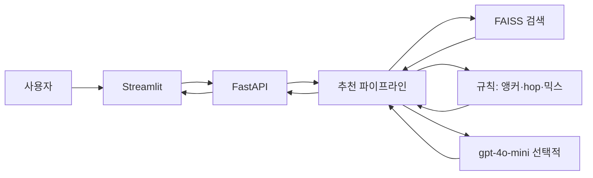

# 부산 여행 코스 추천


날짜·동행·목적·숙소·활동 강도를 입력하면, TourAPI 장소 데이터를 **RAG로 검색**해  
**전날·당일 숙소 근처**에서 목적에 맞는 일차별 코스를 만듭니다.

검색·동선·하루 구성은 규칙 코드가 담당하고,  
`OPENAI_API_KEY`가 있을 때만 LLM이 **후보 중 장소 선택 + 한 줄 이유**를 돕습니다.  
키가 없으면 FAISS 검색 결과만으로 초안을 만듭니다.

---

## 주요 기능

- 여행 기간 최대 7일, 동행·목적별 맞춤 검색
- TourAPI 숙박을 **전날 + 당일 숙소** 이중 앵커로 사용 (OR)
- **활동 강도 1~5** → 장소 성격만 (카페·실내 ↔ 산·언덕). 하루 장소 수는 항상 **6곳**
- 일반 목적: 오전/오후/저녁 각 장소 1 + 음식점 1  
  맛집: 오전·저녁 음식점 2, 오후 음식점 1 + 장소 1
- 탐색 반경 기본 **2.5km**, 같은 숙소 연속 투숙 시 **2.5 → 4.0 → 5.5…** (cap 8km)
- 숙소 변경일: 동선을 **전날 숙소 → 당일 숙소** 방향으로 정렬
- Streamlit UI → FastAPI `POST /api/recommend`
- 품질 스모크: `python -m scripts.eval_smoke` → [docs/EVAL.md](docs/EVAL.md)

---

## 기술 스택

| 구분 | 기술 |
|------|------|
| Frontend | Streamlit |
| Backend | FastAPI |
| RAG | sentence-transformers, FAISS (`faiss-cpu`) |
| LLM | OpenAI `gpt-4o-mini` (선택) |
| 데이터 | 한국관광공사 TourAPI 4.0 |
| Language | Python |
| AI Agent | Cursor |

---

## LLM + RAG

핵심은 **숙소 근처·목적에 맞는 후보를 먼저 좁히는 RAG**입니다.  
LLM은 그 후보 안에서만 고르도록 해, 없는 장소를 지어내지 않게 했습니다.

| 단계 | 담당 | 하는 일 |
|------|------|---------|
| 인덱싱 | 전처리 스크립트 | TourAPI → JSONL → 임베딩 → FAISS |
| 검색 | `retriever` + 규칙 | 앵커·반경·목적 쿼터·강도 가점으로 일차별 후보 |
| 선택 | `gpt-4o-mini` (선택) | 후보 id만 고르고 짧은 이유 (`SELECTED_IDS_DAY{n}`) |
| 동선·채움 | `routing` + `chain` | NN 정렬, hop 상한, **하루 6곳 슬롯** |
| 화면 | 서버 렌더 | 오전/오후/저녁 마크다운 확정 |

키가 없으면 LLM을 건너뛰고, 검색 풀에서 목적 믹스·동선 규칙만으로 초안을 만듭니다.

**왜 이렇게 나눴는지**

- 환각 완화 — 최종 장소는 FAISS 후보 id에만 의존
- 여행 제약 — 반경·hop·6곳 슬롯·일차 중복 제외는 코드로 강제
- LLM은 얇게 — 프롬프트 연결만 LangChain LCEL. 검색·벡터스토어는 직접 구현

문서 약 **2,225건** (`data/processed/busan_places.jsonl`) · 인덱스 `data/processed/faiss_index/`

---

## 아키텍처



1. 일차마다 전날·당일 숙소 반경에서 목적 쿼터별 multi-recall  
2. 주 카테고리 점수 가산 → 후보 풀  
3. LLM이 `SELECTED_IDS_DAY{n}`으로 선택 (키 없으면 `ensure_daily_mix`)  
4. 동선 정렬·hop 보정 → 슬롯 템플릿(6곳) → 서버 마크다운 렌더  

핵심 모듈: `preferences.py` · `retriever.py` · `chain.py` · `routing.py` · `prompt_templates.py`

---

## 입력 · 하루 구조

| 필드 | 설명 |
|------|------|
| `start_date`, `end_date` | 여행 기간 (1~7일) |
| `companion` | 혼자 / 커플 / 친구 / 가족 / 기타 |
| `purpose` | 힐링 / 맛집 / 문화관광 / 쇼핑 / 자연/액티비티 / 종합 |
| `lodging_ids` | TourAPI 숙박 id. 1개면 전 기간 동일 |
| `intensity` | 1~5. **장소 성격만** (개수 무관) |

| 목적 | 오전 | 오후 | 저녁 |
|------|------|------|------|
| 맛집 외 | 장소 + 음식점 | 장소 + 음식점 | 장소 + 음식점 |
| 맛집 | 음식점 2 | 음식점 + 장소 | 음식점 2 |

| 동일 숙소 연속일 | 반경 |
|------------------|------|
| 1일차 | 2.5km |
| 2일차 | 4.0km |
| 3일차 | 5.5km |
| … | cap 8km |

후보는 **전날 숙소 반경** 또는 **당일 숙소 반경**이면 통과 (OR).

API: `GET /api/lodgings?q=` · `POST /api/recommend`

---

## 프로젝트 구조

```
.
├── frontend/app.py
├── backend/                 # FastAPI, routers, schemas, services
├── ml/
│   ├── rag/                 # chain, retriever, routing, preferences, prompts
│   ├── embeddings/
│   └── vectorstore/
├── docs/                    # EVAL.md, demo.gif
├── scripts/                 # collect_tourapi, build_faiss, eval_smoke
└── data/processed/          # busan_places.jsonl, faiss_index/
```

---

## 설치 및 실행

### 1. 환경

```bash
git clone <repository-url>
cd <repository-name>

python -m venv .venv
# Windows: .venv\Scripts\activate
# macOS/Linux: source .venv/bin/activate

pip install -r requirements.txt
```

### 2. 환경 변수

프로젝트 루트에 `.env`를 만들고 필요한 키를 넣습니다.

| 변수 | 용도 |
|------|------|
| `TOUR_API_KEY` | TourAPI 재수집용. `data/processed/`가 있으면 실행만 할 때는 불필요 |
| `OPENAI_API_KEY` | 장소 선택·한 줄 이유. 없으면 검색·규칙만으로 초안 |

`.env`는 Git에 올리지 않습니다.

### 3. 데이터

실행에 필요한 `data/processed/`는 레포에 포함합니다.  
원본 `data/raw/`는 용량 때문에 Git에 올리지 않습니다.

다시 수집할 때:

```bash
# 공공데이터포털에서 한국관광공사 국문 관광정보 서비스 신청 후 TOUR_API_KEY 설정
# 부산: lDongRegnCd=26
python -m scripts.collect_tourapi
python -m scripts.build_faiss
```

### 4. 실행

서버 기동 시 임베딩·FAISS를 한 번 로드합니다. `.env` 변경 후 uvicorn을 재시작하세요.

```bash
python -m uvicorn backend.main:app --reload
```

다른 터미널:

```bash
python -m streamlit run frontend/app.py
```

- API: http://localhost:8000  
- UI: http://localhost:8501  

### 5. 평가

```bash
python -m scripts.eval_smoke
```

자세한 지표는 [docs/EVAL.md](docs/EVAL.md)를 참고하세요.

---

## 라이선스

MIT License
